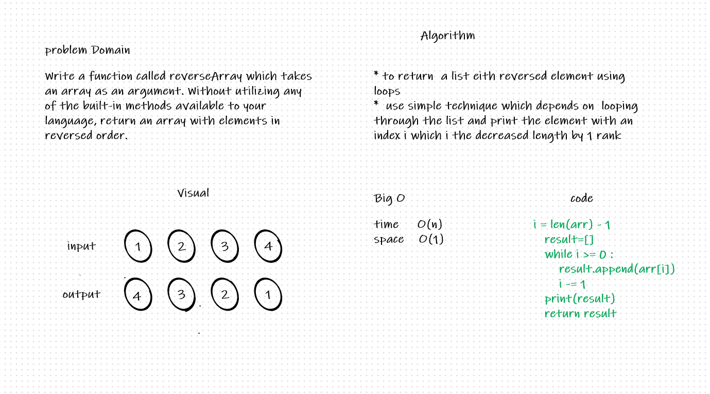
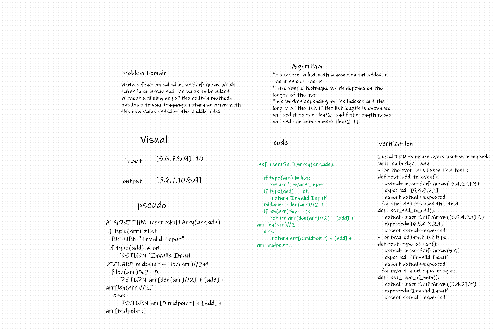
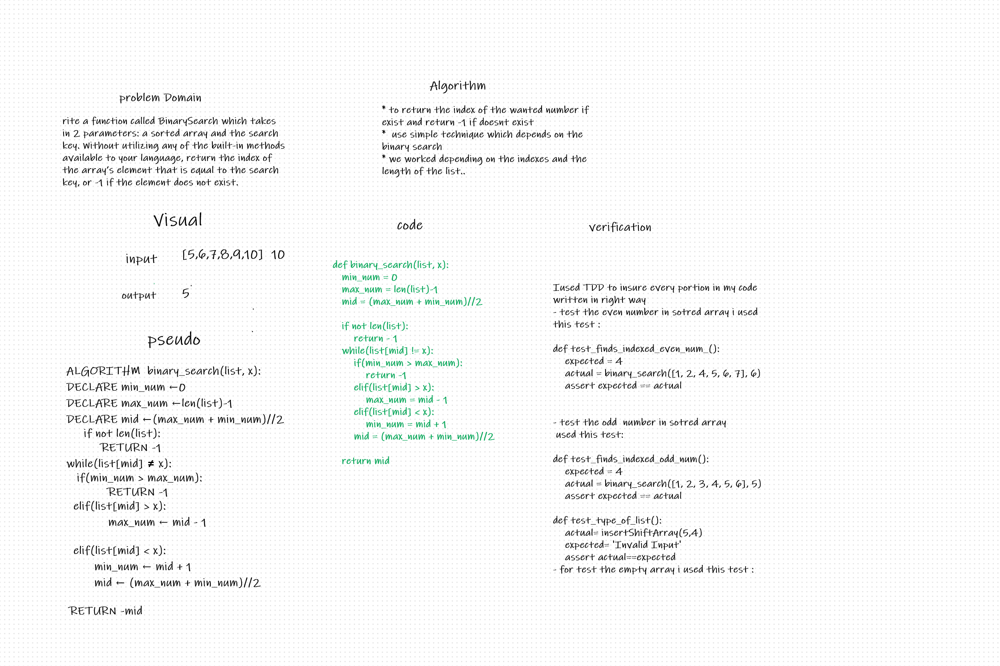

## table of content 
|  challange name |                                  pull request                                  |  
|-----------------|--------------------------------------------------------------------------------|
| arry_reverse    | https://github.com/RaniaAbdullahh/data-structures-and-algorithms-python/pull/1 |
| arry_shift      | https://github.com/RaniaAbdullahh/data-structures-and-algorithms-python/pull/2 |

# Reverse an Array
Python provides us with various ways of reversing a list, We will go through very  simple  technique on how a list in python can be reversed.
## Challenge
the challage is that we are given a list as input and we have to reverse it as an output 
## Approach & Efficiency
I used a simple technique which depends on  looping through the list and print the element with an index i which i the decreased length by 1 rank 
## Solution
<!-- Embedded whiteboard image -->

# shift an array 
shift an array means to change the places of the the list element either to the right or left by adding a new element to it 

## Challenge Description
Write a function called insertShiftArray which takes in an array and the value to be added. Without utilizing any of the built-in methods available to your language, return an array with the new value added at the middle index.

## Approach & Efficiency
we worked depending on the indexes and the length of the list, if the list length is evevn we will add it to the [len/2] and f the length is odd will add the num to index [len/2+1]

## Solution

# array binary search
  function takes in 2 parameters: a sorted array and the search key.  return the index of the array’s element that is equal to the search key, or -1 if the element does not exist.
## Challenge Description
 function takes in 2 parameters: a sorted array and the search key.  return the index of the array’s element that is equal to the search key, or -1 if the element does not exist.

## Approach & Efficiency
* to return the index of the wanted number if exist and return -1 if doesnt exist
*  use simple technique which depends on the binary search 
* we worked depending on the indexes and the length of the list..

## Solution
