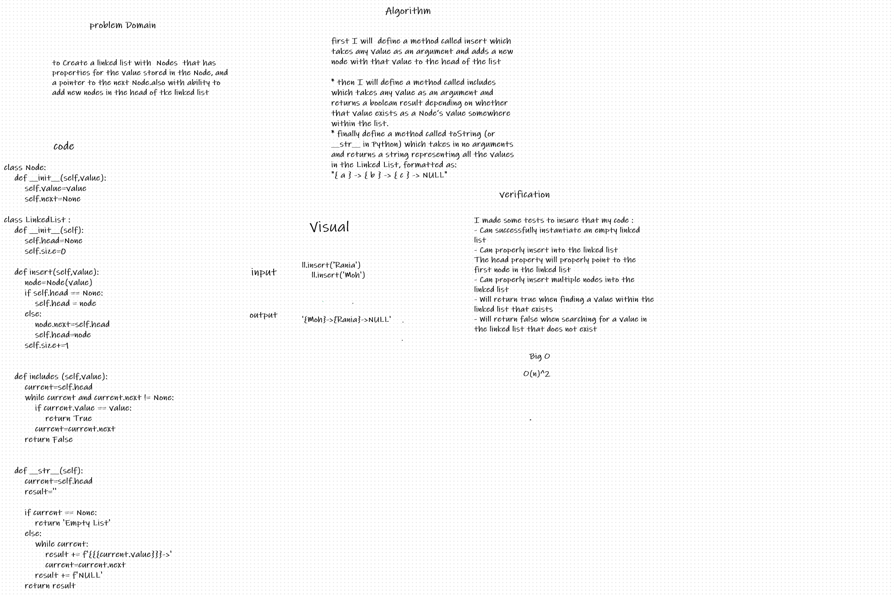
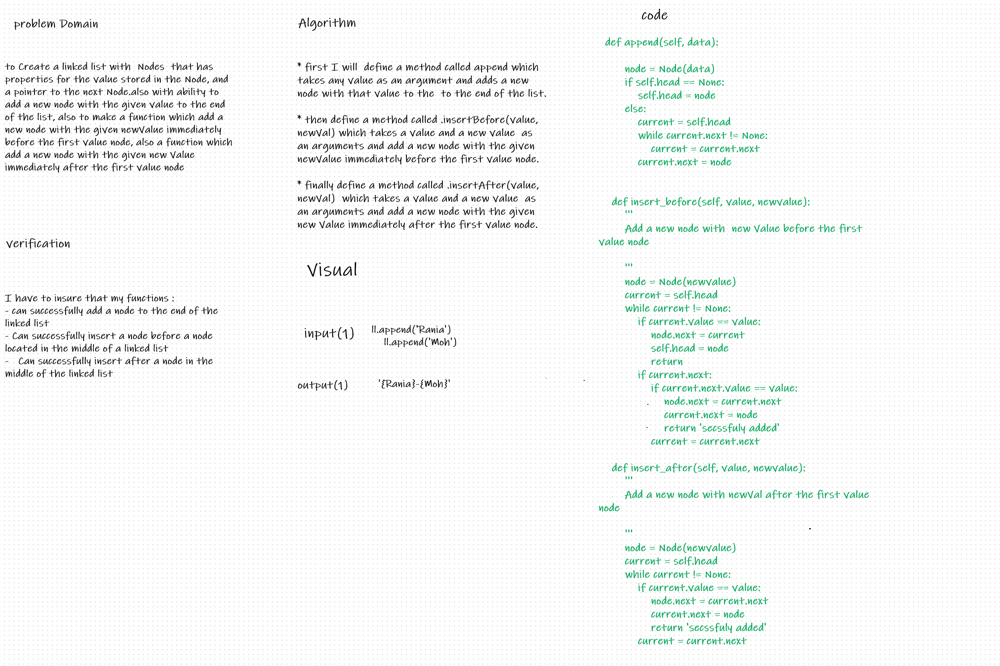
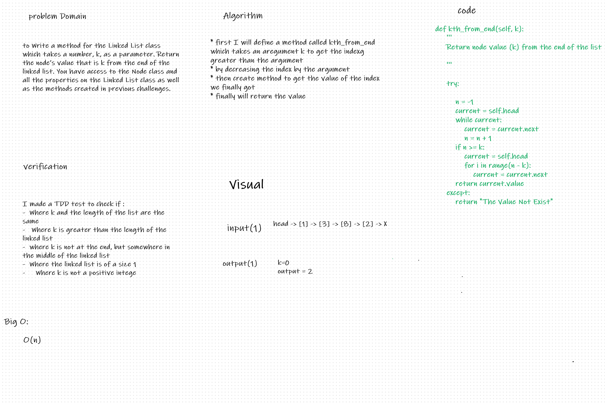
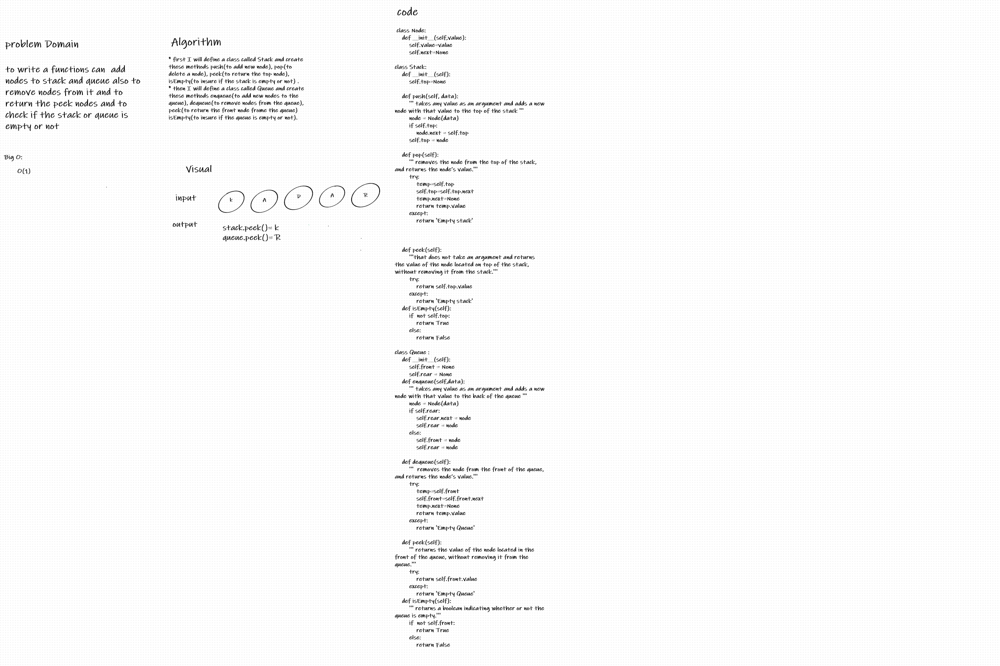
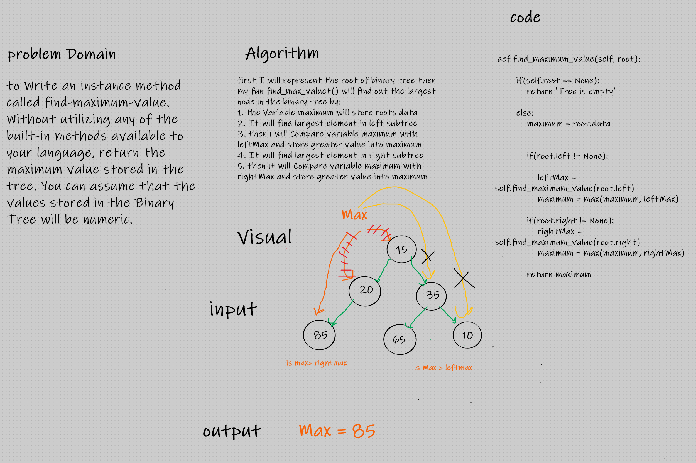

## table of content 
|  challange name   |                                  pull request                                  |  
|-------------------|--------------------------------------------------------------------------------|
| arry_reverse      | https://github.com/RaniaAbdullahh/data-structures-and-algorithms-python/pull/1 |
| arry_shift        | https://github.com/RaniaAbdullahh/data-structures-and-algorithms-python/pull/2 |
|  arry_binary_shift|https://github.com/RaniaAbdullahh/data-structures-and-algorithms-python/pull/3  |
| linked_list       |https://github.com/RaniaAbdullahh/data-structures-and-algorithms-python/pull/4  |

# Reverse an Array
Python provides us with various ways of reversing a list, We will go through very  simple  technique on how a list in python can be reversed.
## Challenge
the challage is that we are given a list as input and we have to reverse it as an output 
## Approach & Efficiency
I used a simple technique which depends on  looping through the list and print the element with an index i which i the decreased length by 1 rank 
## Solution
<!-- Embedded whiteboard image -->

# shift an array 
shift an array means to change the places of the the list element either to the right or left by adding a new element to it 

## Challenge Description
Write a function called insertShiftArray which takes in an array and the value to be added. Without utilizing any of the built-in methods available to your language, return an array with the new value added at the middle index.

## Approach & Efficiency
we worked depending on the indexes and the length of the list, if the list length is evevn we will add it to the [len/2] and f the length is odd will add the num to index [len/2+1]

## Solution

# array binary search
  function takes in 2 parameters: a sorted array and the search key.  return the index of the array’s element that is equal to the search key, or -1 if the element does not exist.
## Challenge Description
 function takes in 2 parameters: a sorted array and the search key.  return the index of the array’s element that is equal to the search key, or -1 if the element does not exist.

## Approach & Efficiency
* to return the index of the wanted number if exist and return -1 if doesnt exist
*  use simple technique which depends on the binary search 
* we worked depending on the indexes and the length of the list..

## Solution

# linked list
to Create a linked list with  Nodes  that has properties for the value stored in the Node, and a pointer to the next Node.also with ability to add new nodes in the head of tke linked list 
## Challenge Description
to Create a linked list with  Nodes  that has properties for the value stored in the Node, and a pointer to the next Node.also with ability to add new nodes in the head of tke linked list 

## Approach & Efficiency
* first I will  define a method called insert which takes any value as an argument and adds a new node with that value to the head of the list with an O(1) Time performance
* then define a method called includes which takes any value as an argument and returns a boolean result depending on whether that value exists as a Node’s value somewhere within the list.
* finally define a method called toString (or __str__ in Python) which takes in no arguments and returns a string representing all the values in the Linked List, formatted as:
"{ a } -> { b } -> { c } -> NULL"

## Solution

# linked list II
to Create a linked list with  Nodes  that has properties for the value stored in the Node, and a pointer to the next Node.also with ability to add a new node with the given value to the end of the list, also to make a function which add a new node with the given newValue immediately before the first value node, also a function which add a new node with the given new Value immediately after the first value node
## Challenge Description
to Create a linked list with  Nodes  that has properties for the value stored in the Node, and a pointer to the next Node.also with ability to add a new node with the given value to the end of the list, also to make a function which add a new node with the given newValue immediately before the first value node, also a function which add a new node with the given new Value immediately after the first value node
## Approach & Efficiency
* first I will  define a method called append which takes any value as an argument and adds a new node with that value to the  to the end of the list.
* then define a method called .insertBefore(value, newVal) which takes a value and a new value  as an arguments and add a new node with the given newValue immediately before the first value node,
* finally define a method called .insertAfter(value, newVal)  which takes a value and a new value  as an arguments and add a new node with the given new Value immediately after the first value node.

## Solution

# ll-kth-from-end
to Write a method for the Linked List class which takes a number, k, as a parameter. Return the node’s value that is k from the end of the linked list. You have access to the Node class and all the properties on the Linked List class as well as the methods created in previous challenges.
## Challenge Description
to Write a method for the Linked List class which takes a number, k, as a parameter. Return the node’s value that is k from the end of the linked list. You have access to the Node class and all the properties on the Linked List class as well as the methods created in previous challenges.
## Approach & Efficiency
* first I will define a method called kth_from_end which takes an aregument k to get the indexg greater than the argument 
* by decreasing the index by the argument 
* then create method to get the value of the index we finally got 
* finally will return the value 

## Solution

# Stacks and Queues
to Write a class called Stack have multiple methods to add an items to  the stake and to pop some items also a method to return the peek node and finally to check if the stacke is empty or not, and add another class to create a queue and have multiple methods to add nodes to the queue and to remove nodes frome the queue also to return the peek node from the queue also a method to check if the queue is empty or not.
## Challenge Description
to Write a class called Stack have multiple methods to add an items to  the stake and to pop some items also a method to return the peek node and finally to check if the stacke is empty or not, and add another class to create a queue and have multiple methods to add nodes to the queue and to remove nodes frome the queue also to return the peek node from the queue also a method to check if the queue is empty or not.
## Approach & Efficiency
* first I will define a class called Stack and create these methods push(to add new node), pop(to delete a node), peek(to return the top node), isEmpty(to insure if the stack is empty or not) .
* then I will define a class called Queue and create these methods enqueue(to add new nodes to the queue), dequeue(to remove nodes from the queue), peek(to return the front node frome the queue) isEmpty(to insure if the queue is empty or not).

## Solution

# Maximum Value in a Binary Tree
to Write an instance method called find-maximum-value. Without utilizing any of the built-in methods available to your language, return the maximum value stored in the tree. You can assume that the values stored in the Binary Tree will be numeric.
## Challenge Description
Write an instance method called find-maximum-value. Without utilizing any of the built-in methods available to your language, return the maximum value stored in the tree. You can assume that the values stored in the Binary Tree will be numeric.
## Approach & Efficiency
* first I will represent the root of binary tree then my fun find_max_valuet() will find out the largest node in the binary tree by:
1. the Variable maximum will store roots data
2. It will find largest element in left subtree 
3. then i will Compare variable maximum with leftMax and store greater value into maximum 
4. It will find largest element in right subtree  
5. then it will Compare variable maximum with rightMax and store greater value into maximum  

## Solution

# breadth first traversal
Write a breadth first traversal method which takes a Binary Tree as its unique input. Without utilizing any of the built-in methods available to your language, traverse the input tree using a Breadth-first approach, and return a list of the values in the tree in the order they were encountered.
## Challenge Description
Write a breadth first traversal method which takes a Binary Tree as its unique input. Without utilizing any of the built-in methods available to your language, traverse the input tree using a Breadth-first approach, and return a list of the values in the tree in the order they were encountered.

## Solution

