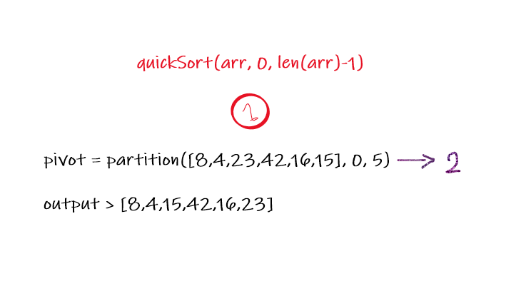
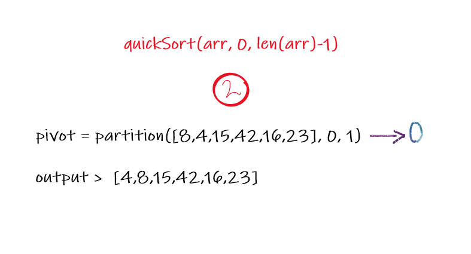

## Description
Quick sort is similar to merge sort, in that it's a conquer and divide style sorting algorythm. It chooses a pivot value and partitions the input array into a left and right array. The main difference between merge sort and quick sort is that by the time quick sort has broken up the array into sub arrays of single elements the array is sorted.

## Pseudocode
ALGORITHM QuickSort(arr, left, right)
if left < right
    // Partition the array by setting the position of the pivot value 
    DEFINE position <-- Partition(arr, left, right)
    // Sort the left
    QuickSort(arr, left, position - 1)
    // Sort the right
    QuickSort(arr, position + 1, right)

ALGORITHM Partition(arr, left, right)
    // set a pivot value as a point of reference
    DEFINE pivot <-- arr[right]
    // create a variable to track the largest index of numbers lower than the defined pivot
    DEFINE low <-- left - 1
    for i <- left to right do
        if arr[i] <= pivot
            low++
            Swap(arr, i, low)

    // place the value of the pivot location in the middle.
    // all numbers smaller than the pivot are on the left, larger on the right. 
    Swap(arr, right, low + 1)
    // return the pivot index point
    return low + 1

ALGORITHM Swap(arr, i, low)
    DEFINE temp;
    temp <-- arr[i]
    arr[i] <-- arr[low]
    arr[low] <-- temp

## Trace
- first itiration
in the first itiration the partition function will be called with the parameters > arr , left=0 , right=5. and it will return pivot = 2. with a partial sorted array [8,4,15,42,16,23].

-  second itiration
in the second itiration the quickstart function will be called recursively. as quickSort([8,4,15,42,16,23], 0, 1) that will recall the partition function and in this itiration it will return pivot = 0, with a partial sorted array [4,8,15,42,16,23].

- third itiration
in the third itiration the quickstart function will be called recursively. as quickSort([4,8,15,42,16,23], 3, 5) that will recall the partition function and in this itiration it will return pivot = 4, with sorted array [4,8,15,16,23,42].

## Efficency
- Time: O(n2) 
- Space: O(1)