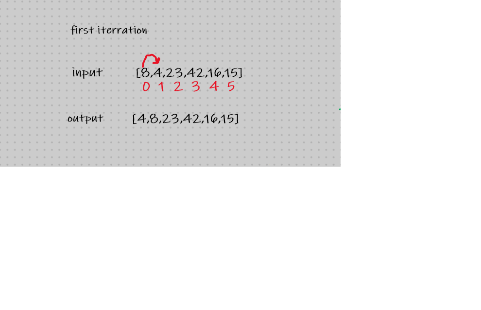
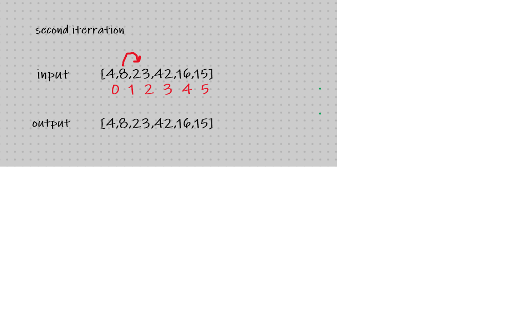
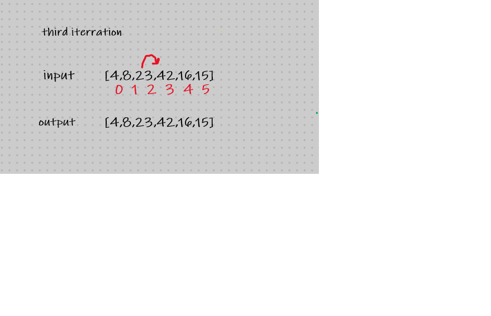
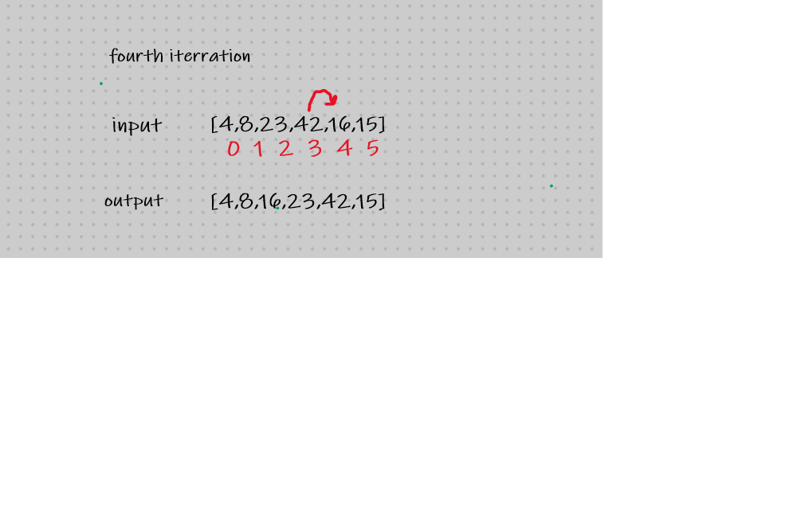
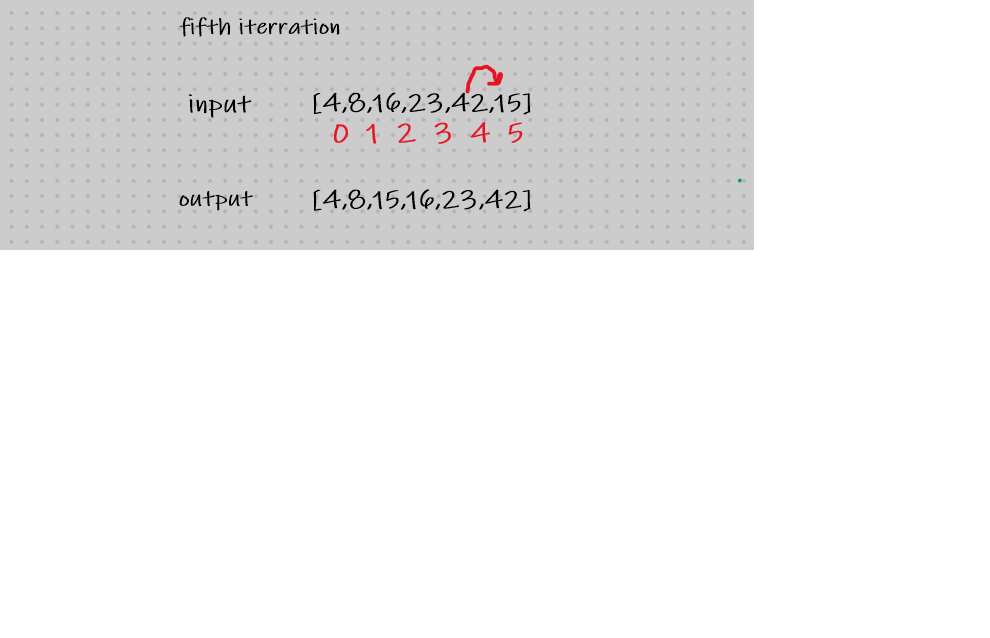

## insertion sort
- Pseudocode
 InsertionSort(int[] arr)
  
    FOR i = 1 to arr.length
    
      int j <-- i - 1
      int temp <-- arr[i]
      
      WHILE j >= 0 AND temp < arr[j]
        arr[j + 1] <-- arr[j]
        j <-- j - 1
        
      arr[j + 1] <-- temp

## Trace
Sample Array: [8,4,23,42,16,15]
- Pass 1:

in the first iteration we check for the value of the first index j if it is smaller than the value of the counter i which is saves in a variable called temp then it will go to the next value 

- Pass 2:

the second iteration we check the following two values for arr[1]=8 and arr[2]=23 , if the 8<23 or not.. no replacement will happen

- Pass 3:

third iteration will check the value  arr[2]=23 and arr[3]=42, if the 23<42 or not.. no replacement will happen

- Pass 4:

fourth iteration will check the value of arr[3]=42 and arr[4]=16, 16 is smaller than arr[3]&arr[2] so it will be placed after arr[1]

- Pass 5:

fifth iteration will check the value of arr[5]=42 and arr[6]=15, 15 is smaller than arr[5]&arr[4]and arr[3] so it will be placed after arr[1]

