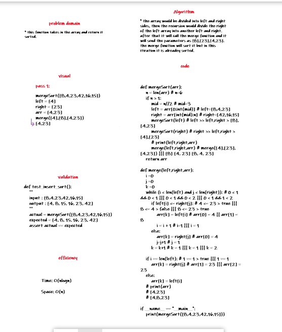

## Merge sort
this function takes in the array and return it sorted.
## Challenge Description
Merge sort is a divide and conquer sorting algorithm. It recursiveley splits each portion of the origin array until it's comparing only two arrays with a single element each. It then merges the sorted subarrays back together.
## Big O notation
- time -> O(n)
- space -> O(n)
## White-Board
